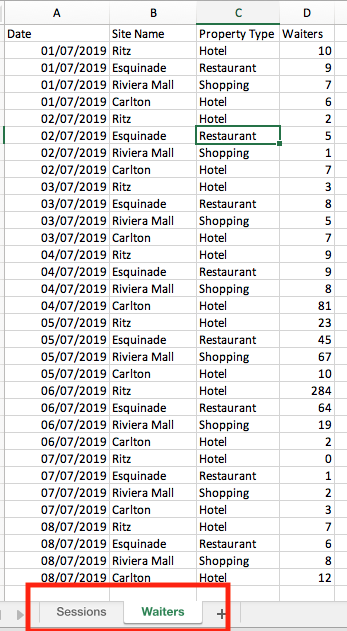
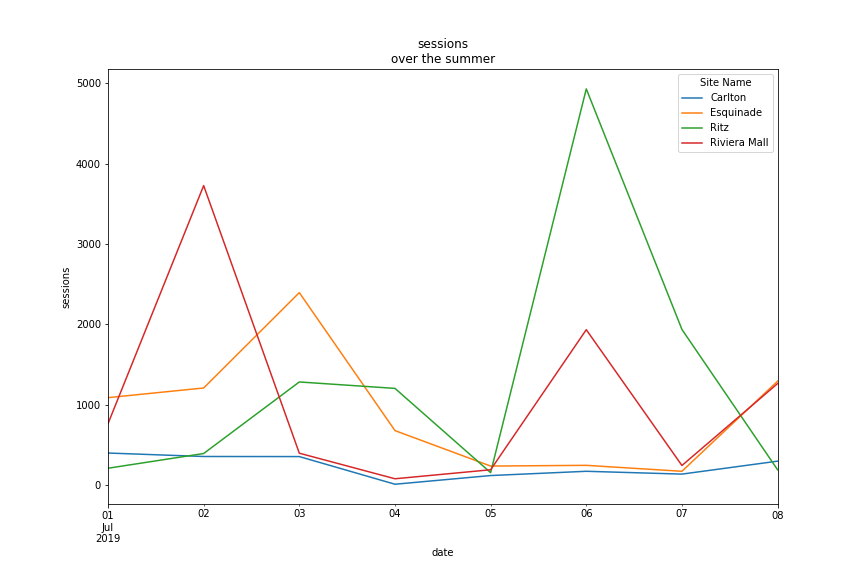

---
jupytext:
  cell_metadata_filter: all, -hidden, -heading_collapsed, -run_control, -trusted
  notebook_metadata_filter: all, -jupytext.text_representation.jupytext_version, -jupytext.text_representation.format_version,
    -language_info.version, -language_info.codemirror_mode.version, -language_info.codemirror_mode,
    -language_info.file_extension, -language_info.mimetype, -toc
  text_representation:
    extension: .md
    format_name: myst
kernelspec:
  display_name: Python 3 (ipykernel)
  language: python
  name: python3
language_info:
  name: python
  nbconvert_exporter: python
  pygments_lexer: ipython3
---

# dessins par groupby

et lire plusieurs feuillets depuis excel

+++

le fichier excel `data/groupby-draw.xlsx` contient ici plusieurs feuillets

+++



+++

les deux feuillets contiennent 2 données différentes pour les mêmes sites / dates

+++

## ce qu'il faut faire

+++

A. visualiser les deux données (Sessions et Waiters) en fonction du temps par site

e.g.



+++

B. mêmes chiffres mais agrégés sur les sites, les deux caratéristiques sur une seule figure (ici avec seaborn)


```{code-cell} ipython3
# à vous

import pandas as pd
import numpy as np
import matplotlib.pyplot as plt
import seaborn as sns
```

```{code-cell} ipython3
sessionsDf = pd.read_excel("data/groupby-draw.xlsx", "Sessions")
waitersDf = pd.read_excel("data/groupby-draw.xlsx", "Waiters")
df = sessionsDf.merge(waitersDf, on=["Date", "Site Name", "Property Type"])
df.head()
```

```{code-cell} ipython3
:tags: []

df2 = df.set_index(["Date", "Site Name"])
#df2.groupby(by="Site Name")["Sessions"].plot()
df2["Sessions"].unstack().plot()
```

```{code-cell} ipython3
:tags: []

fig, ax = plt.subplots()
sns.lineplot(data=df3, x="Date", y="Sessions", ax=ax)
sns.lineplot(data=df3, x="Date", y="Waiters", ax=ax)
```

---
